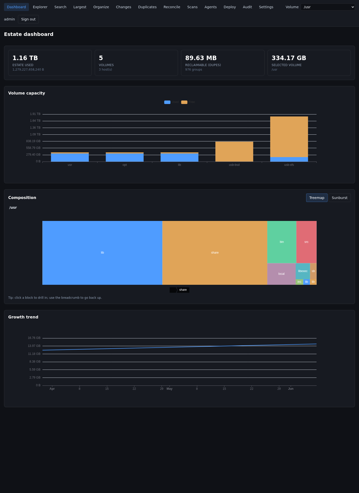
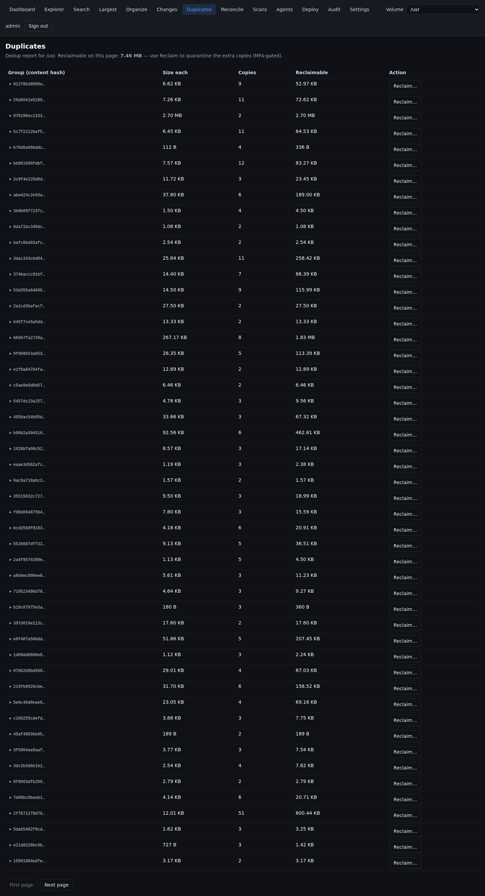
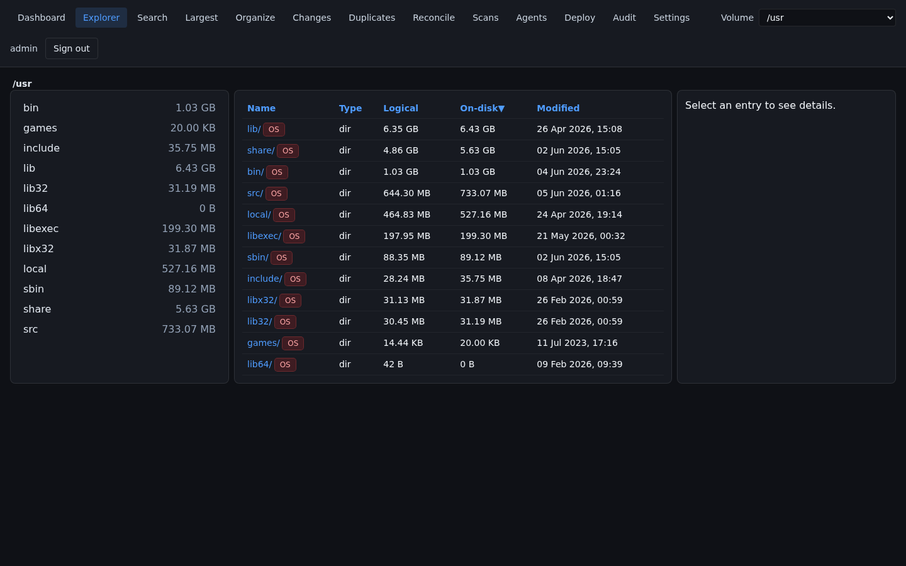
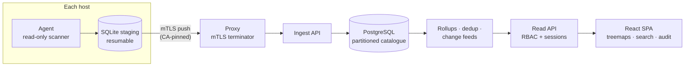

<div align="center">

<!-- Primary mark — photoreal device hero (assets/brand/fathomline-logo.jpeg, 2048²). -->


# Fathomline

**Fathomline — sound out your storage estate.**

_by **Bionic Technologies** · built on the **Fathom** engine · [AGPL-3.0](LICENSE)_

</div>

> **Where did all the disk space go — across every machine you run?**
> Fathomline is the storage-estate analyzer: it scans your whole estate (NAS, servers,
> workstations), shows you where the bytes live, finds what's genuinely duplicated, and lets
> you reclaim space *safely* — with an audit trail.
>
> *A fathomline is the weighted rope sailors lowered to measure the deep. Drop one into your
> storage and learn what's really down there.*

[](https://github.com/bionic-tech/fathomline/actions/workflows/ci.yml)
[](LICENSE)
[](.github/workflows/ci.yml)


Tools like TreeSize, WinDirStat and ncdu answer the disk-space question for **one machine at a
time**. Fathomline answers it for the **whole fleet**: lightweight read-only agents scan each
host and push file metadata over mutually-authenticated TLS into a central catalogue, where a
React UI gives you treemaps, estate-wide search, growth trends, duplicate detection and —
strictly opt-in — safe cleanup. (Under the hood it's built on the **Fathom** engine — the
`fathom` Python package and `FATHOM_*` configuration you'll see throughout the code.)

Built for homelabs that grew up: multi-terabyte ZFS pools, a NAS full of "I'll sort it later",
nightly backups of things that are already backed up twice.



<details>
<summary><b>More screenshots</b> — duplicates &amp; the three-pane explorer</summary>




</details>

*(Live captures from a seeded local instance — regenerate any time with
`scripts/localdev/run.sh` + `node scripts/localdev/screenshot.mjs`.)*

## The story

A *fathomline* is the weighted, knotted rope sailors dropped over the side to sound out how deep
the water really was. Most disk tools measure a single machine — which, across a real estate, is
like measuring a puddle while you're standing in a lake. Fathomline sounds out the **whole** estate
instead, and treats your data as something to protect first: read-only by default, with any cleanup
strictly opt-in, reversible and audited. It's free and open source, by Bionic Technologies.

Read the full story → [docs/STORY.md](docs/STORY.md)

## Features

- **Estate-wide visibility** — one dashboard over every host/volume: treemap & sunburst
  drill-down, largest files/directories, estate-wide live search, churn ("what changed this
  week"), per-volume growth history.
- **Real duplicate detection** — progressive BLAKE3 hashing (size → head/tail sample → full
  content confirmation), grouped across hosts. No "same name and size" guesswork.
- **ZFS / TrueNAS aware** — descends child datasets, skips `.zfs` control dirs, pauses full
  scans during array resync, talks to the TrueNAS middleware over its WebSocket control plane.
- **Storage backends** — local POSIX/ZFS scans plus remote SFTP and SMB shares; NTFS/exFAT
  volume handling for mixed estates.
- **Safe reclaim, OFF by default** — the write path ships disabled. When you enable it:
  Ed25519-signed single-use jobs, quarantine-first (reversible) moves, full-content drift
  re-check before any mutation, blast-radius caps, step-up MFA in the UI, and a hash-chained
  append-only audit log.
- **Sandboxed previews** — file previews render in a per-request [gVisor](https://gvisor.dev)
  sandbox: no network, read-only, all capabilities dropped. Untrusted bytes never decode in the
  core process.
- **Agent deployment wizard** — enrol new hosts by pasting one bootstrap command (pull mode) or
  batch push-deploy over SSH with host-key pinning (push mode).
- **Optional local-LLM "Organize"** — content-aware tidy-up suggestions via Ollama (local,
  no egress) or any OpenAI-compatible endpoint. Off by default, like everything that writes.
- **Real auth** — local users with Argon2 + TOTP MFA, or plug into your SSO via forward-auth /
  OIDC. Deny-by-default RBAC with per-host/per-volume scoping.

## Try it in 60 seconds

No fleet, no Postgres, no certificates — a full Fathomline on SQLite, populated by really
scanning a couple of local directories so every page shows genuine data:

```bash
git clone https://github.com/bionic-tech/fathomline && cd fathomline
scripts/localdev/run.sh
```

Open <http://127.0.0.1:8099/> and log in as `admin` / `localdev-admin-pw`.
See [scripts/localdev/README.md](scripts/localdev/README.md) for reset/seed options.

## How it works



- Agents are **read-only by default** (`write_enabled=False` is fail-closed config, not a
  convention) and run containerised with capabilities dropped to `CAP_DAC_READ_SEARCH`.
- The catalogue scales to tens of millions of files: bounded-memory walks, two-level
  partitioned tables, streaming rollups.
- Incremental scans ride `zfs diff` / re-stat change feeds instead of re-walking everything.

## Deploying for real

For a multi-host estate you'll want the production shape: PostgreSQL, the nginx mTLS proxy, a
private CA for agent identities, and nightly scan schedules. Start with:

- [Quickstart deployment](deploy/quickstart/README.md) — Postgres + API/UI via
  `docker compose up`
- [Multi-host deployment guide](docs/guides/multi-host-deployment.md) — the full production
  shape: private CA, mTLS proxy, agent enrolment (wizard or manual), scan schedules, hardening
- [API reference](docs/api/README.md) — the committed, drift-checked OpenAPI spec
- [Architecture overview](docs/architecture/01-architecture-overview.md)
- [Architecture decision records](docs/decisions/) — why things are the way they are

## Security

Security documentation lives in [SECURITY.md](SECURITY.md) (reporting + posture summary).
Highlights: deny-by-default RBAC on every route, server-side sessions (httpOnly, SameSite),
constant-time agent-identity checks behind the mTLS boundary, hash-chained audit log with fork
rejection, signed + nonce-guarded remediation jobs, and a strict CSP with zero inline script.
The write path has been through repeated adversarial review; findings and their fixes are part
of the test suite.

## Project status

**Alpha (0.1.0).** The full pipeline — scan → ingest → catalogue → UI → (gated) remediation —
runs nightly in production on the author's multi-host estate (~40M files). APIs and schemas may
still change between minor versions. Quality gates on every commit: `ruff`, `mypy --strict`,
~800 hermetic Python tests, vitest + strict TypeScript for the SPA.

Where it's headed — Windows agent, reflink-based zero-deletion reclaim, and more — lives in
the [ROADMAP](ROADMAP.md).

## Comparison

| | Fathomline | ncdu / TreeSize / QDirStat | diskover |
|---|---|---|---|
| Multi-host estate view | ✅ | ❌ per machine | ✅ |
| Content-verified dedup | ✅ BLAKE3 full-bit | ❌ (or name/size only) | partial |
| Safe, audited reclaim | ✅ signed + quarantine-first | manual delete | ❌ |
| ZFS/TrueNAS awareness | ✅ | ❌ | ❌ |
| Sandboxed previews | ✅ gVisor | n/a | ❌ |
| Self-hosted, no cloud | ✅ | ✅ | ✅ (ES stack) |
| Backing store | PostgreSQL (or SQLite) | n/a | Elasticsearch |

## Contributing

See [CONTRIBUTING.md](CONTRIBUTING.md) — dev setup is `uv sync --extra dev` + `npm ci`, and the
quality gate is one command. Bug reports and "this assumption breaks on my setup" issues are
especially valuable at this stage.

## License

[AGPL-3.0](LICENSE) © Bionic Technologies. Free to use, self-host and modify; if you offer a
modified Fathomline as a network service, share your changes.
