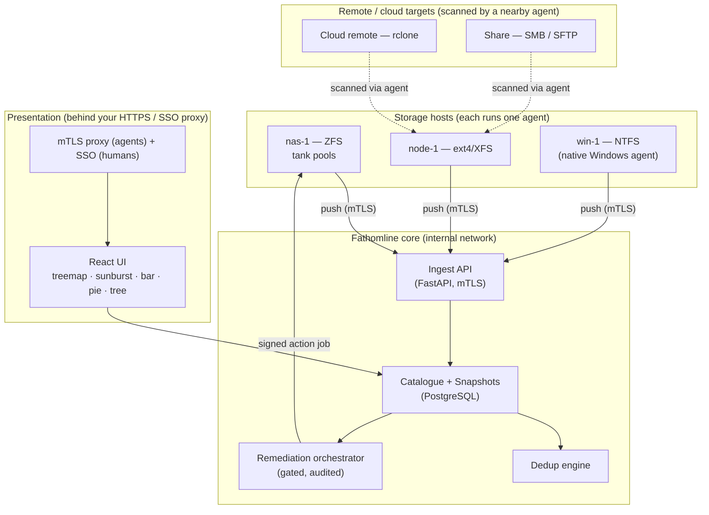
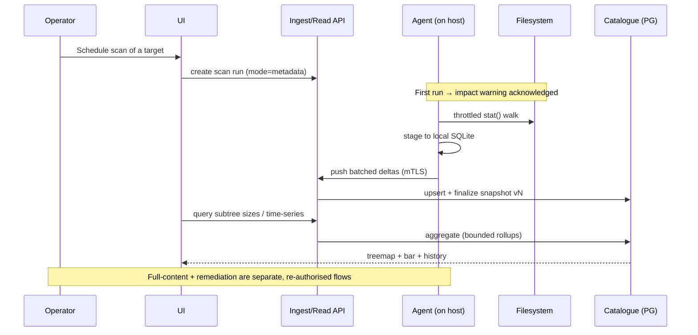

# Fathomline — Architecture Overview

Fathomline is a multi-host, multi-filesystem disk-estate analyzer. This document is the
self-contained map of how it fits together; the *why* behind each significant choice lives
in the [Architecture Decision Records](../decisions/), and the operational shape is in the
[multi-host deployment guide](../guides/multi-host-deployment.md).

> **Naming.** *Fathomline* is the product. *Fathom* is the engine codename you'll see in the
> code: the Python package is `fathom`, configuration is `FATHOM_*`. They are the same thing.

## What it answers

Fathomline answers three questions across an entire storage estate, not one machine at a time:

1. **Where are my bytes?** — navigable folder drill-down with treemap / sunburst / tree
   views, and per-volume used-vs-free charts, aggregated across every host.
2. **What's redundant?** — content-based duplicate detection (BLAKE3 full-content hashing),
   plus zero-egress cross-cloud duplicate *reporting* via provider hashes. Reports only;
   nothing is ever deleted without an explicit, audited operator action.
3. **How is it changing?** — immutable per-run snapshots so growth and churn are queryable
   over time.

It targets the real shape of a homelab-grown-up estate: ZFS pools on TrueNAS, ext4/XFS on
Linux nodes, NTFS/exFAT on Windows and removable media, and cloud/remote stores reached over
rclone, SMB, or SFTP — where I/O characteristics differ by an order of magnitude and a naïve
full-content scan can stall a host. The architecture makes those topology differences
first-class and makes "do not impact the system" an enforced contract, not an aspiration.

## Shape at a glance

A modular monolith with a clear seam between the agents that read filesystems and the core
that stores and serves the catalogue:

```
agent (read-only scanner)
  → local SQLite staging (resumable)
  → CA-pinned mTLS push
  → ingest API → partitioned PostgreSQL catalogue
  → rollups / dedup
  → read API → React + TypeScript SPA
```

| Decision | Choice | Rationale |
|----------|--------|-----------|
| Topology | **Agent-per-host, push to a central catalogue** | Reads (and byte-hashing) happen locally; the core never needs filesystem access to remote hosts; scale by adding agents. Single-host and distributed deployments share one code path ([ADR-016](../decisions/ADR-016-single-host-and-distributed-topologies.md)). |
| Read/write split | **Separate components, separate privileges** | A compromised or buggy scanner cannot mutate data. The write path is a distinct, gated subsystem. |
| Datastore | **PostgreSQL central + SQLite local staging** | Agents stage locally so a network blip never loses a scan; the central catalogue is partitioned for tens of millions of rows. |
| FS / transport extensibility | **`StorageBackend` Protocol + registry** | A new filesystem or transport is a plugin implementing one interface; FS-specific truths (ZFS compression, NTFS streams) live behind it. |
| Agent identity | **mTLS client-cert fingerprint** | Agents are identified by their pinned certificate fingerprint; defence-in-depth at the ingest boundary ([ADR-017](../decisions/ADR-017-defense-in-depth-ingest-authentication.md)). |
| Charting | **ECharts + D3** (Apache/BSD/MIT) | Free and redistributable; no commercial-use restriction. |
| Stack | **FastAPI · Pydantic v2 · async Python 3.12 · SQLAlchemy 2.0 · React + TS (strict)** | Async throughout; typed end-to-end (mypy `--strict`, TS strict). |

## System context



Two trust boundaries, deliberately separate: **humans** reach the API/UI through your HTTPS
or SSO proxy; **agents** reach only `/api/v1/agents/` through an mTLS terminator that verifies
the client cert and stamps a shared proxy secret, so a request that bypasses the proxy is
rejected. Neither path can cross into the other. Remote/cloud targets are *not* separate
components — a nearby agent walks them over the network and pushes them as their own volumes.

## Components

### Agent / collector — `src/fathom/agent/`
Enumerates a target in one of three modes (metadata scan, full-content scan, remediation),
self-throttles, stages results to local SQLite, and pushes deltas to the ingest API over
mTLS. Ships as a container and (for Windows) a native build ([ADR-027](../decisions/ADR-027-native-windows-agent.md)).
Staging is resumable, so a network loss never discards a scan, and re-runs are idempotent.

### Storage backends — `src/fathom/backends/`
Present a uniform walk / stat / hash interface while hiding FS-specific truths: ZFS
logical-vs-allocated size under compression and snapshot directories to skip; NTFS alternate
data streams and compression; exFAT/FAT lacking an ownership model; cloud objects reached via
rclone. The backend also resolves **device topology** (which block device backs a path, its
transport bus, and whether it is part of a RAID set) so the UI can distinguish "USB RAID5"
from "NVMe" and the throttle can act on it. Backends register through a `BackendRegistry`;
the set today is POSIX, ZFS, NTFS/exFAT, native Windows, SFTP, SMB, and rclone.

### Ingest API — `src/fathom/api/` (agent routes)
Authenticates agents by mTLS client-cert fingerprint, validates pushed batches (Pydantic),
**re-vets every agent-supplied path server-side**, upserts into the catalogue, and finalizes a
snapshot per scan run ([ADR-018](../decisions/ADR-018-synchronous-post-drain-finalize.md)).
Oversized or malformed batches are rejected.

### Catalogue + snapshots — `src/fathom/core/catalogue/`
The queryable tree of every host / volume / path with logical and on-disk sizes, partitioned
by `(host, volume)` for scale. Immutable per-run snapshots make growth-over-time and
"what changed since last week" possible; nothing is silently overwritten. Subtree aggregation
uses bounded-memory rollups ([ADR-020](../decisions/ADR-020-bounded-memory-rollup-recompute.md)).

### Dedup engine — `src/fathom/core/`
Groups candidate duplicates by (size → partial hash → full BLAKE3 hash) and produces
**reports only**. A separate, zero-egress path reports cross-cloud duplicates using the cloud
provider's own hash ([ADR-028](../decisions/ADR-028-rclone-cloud-backend.md)) — report-only,
and never a driver of remediation. A reviewed plan reaches the write path only if an operator
authorises it.

### Remediation orchestrator (gated write path) — `src/fathom/core/` + `workers/`
Turns an operator-approved, dry-run-validated plan into signed action jobs dispatched to the
owning agent's write-mode component ([ADR-025](../decisions/ADR-025-production-signed-job-dispatch-channel.md)).
Actions are reversible-by-design where possible (move/rename — [ADR-023](../decisions/ADR-023-reversible-move-rename-remediation-action.md)).
This is the highest-risk surface: off by default, full audit mandatory, dry-run first.

### Adjacent read-side subsystems
- **Content-aware Organize** — read-only reorganisation *suggestions* from a pluggable
  inference provider ([ADR-021](../decisions/ADR-021-content-aware-organize-subsystem.md),
  [ADR-022](../decisions/ADR-022-pluggable-inference-provider.md)).
- **Cross-host reconciliation** — divergence detection between two trees on different hosts
  ([ADR-024](../decisions/ADR-024-cross-host-reconciliation.md)).
- **Agent deployment** — push (SSH) and pull (enrolment-token) provisioning of new agents,
  off by default ([ADR-026](../decisions/ADR-026-agent-deployment-subsystem.md)).

### Presentation — `src/fathom/web/`
A React + TypeScript (strict) SPA behind your edge proxy. The read API surface is a different
route group, with different auth dependencies, from the action API surface — so the UI and
most tokens never touch the write endpoints. Charts via ECharts/D3.

## Filesystem & storage-topology support

Prioritised for what homelabs actually run, with the rest as plugins behind `StorageBackend`.

| Filesystem | Logical size | On-disk size source | Notes / gotchas |
|------------|--------------|---------------------|-----------------|
| **ZFS** (TrueNAS) | `stat` st_size | compression-aware allocated size | skip `.zfs/snapshot`; respect dataset boundaries; `zfs diff` for incremental |
| **ext4 / XFS** (Linux) | st_size | st_blocks × 512 | `fanotify` for the change feed |
| **NTFS** (Windows) | st_size | cluster-rounded | alternate data streams, compression; native agent or SMB |
| **exFAT / FAT32** (USB) | st_size | cluster-rounded | no ownership/permissions model |
| **Cloud object** (via rclone) | object size | provider-reported | metadata + provider-hash dedup; no full-content hashing over the wire |

| Device transport | Detected via | Why it matters |
|------------------|--------------|----------------|
| NVMe | `lsblk -d -o NAME,TRAN`, `/sys/block/*/queue` | fast — full-content scans can run aggressively |
| SATA / SAS | `lsblk TRAN` | moderate |
| **USB** | `lsblk TRAN=usb` | slow — throttle hard; warn before full-content |
| **RAID-5 over USB** | mdadm `/proc/mdstat` or controller + USB bus | slow and rebuild-fragile — **full-content scans blocked during resync** |

That last row is a safety rule the topology layer *enforces*, not just a label.

## Transport & connectivity

**Metadata over the wire is fine; content hashing happens where the data physically lives.**
Full-content scans only ever run via an on-host agent — never by streaming bytes across a
remote transport.

| Transport | Mode | Use it for | Notes |
|-----------|------|-----------|-------|
| **Agent-push / mTLS** | local read on host | any host you can deploy an agent to | primary path — fastest, safest, zero remote FS access for the core |
| **rclone** | remote target on an agent | cloud remotes (S3/Blob/GCS/Drive/…) | metadata + provider-hash dedup; needs an rclone-equipped agent image |
| **SMB / CIFS** | remote target on an agent | Windows shares, appliances | metadata fine; full-content refused over the wire |
| **SFTP** | remote target on an agent | hosts reachable over SSH but not installable | metadata fine; full-content refused over the wire |

Remote credentials are **secret references** the agent resolves at runtime — never written
into a config or bundle inline ([ADR-029](../decisions/ADR-029-remote-volume-representation.md)).

## Data flow



## Data model (overview)

Core entities (full schema in the catalogue models and migrations):

- **`host`** — agent identity, OS, agent version, mTLS cert fingerprint, last-run health.
- **`volume`** — mountpoint (or synthetic mount for remote/cloud, plus a display label),
  filesystem type, total/used/free, backing device + transport + RAID role, ZFS dataset/pool.
- **`fs_entry`** — per path: parent, name, depth, materialised path, logical and on-disk size,
  mtime/ctime, owner uid/gid, inode, is_dir, FS-specific flags, content hash and (for cloud)
  provider hash. Partitioned by `(host, volume)`.
- **`snapshot` / `agent_run`** — immutable scan run and its outcome (entries seen, scopes
  failed) for observability.
- **`dup_group` / `dup_member`** — content-hash group, member entries, reclaimable bytes.
- **`action_job` / `action_item` / `audit_log`** — the gated write path; every action records
  who, when, the before-state, and the result, on a hash-chained tamper-evident log
  ([ADR-019](../decisions/ADR-019-tamper-evident-audit-chain-hardening.md)).

Snapshots are append-only — which is exactly what makes growth-over-time queryable.

## API surface (indicative)

| Method | Path | Surface | Description |
|--------|------|---------|-------------|
| POST | `/api/v1/agents/ingest` | agent (mTLS) | push a batch of `fs_entry` deltas |
| POST | `/api/v1/scans` | read+ | create a scan run (mode, target, throttle profile) |
| GET | `/api/v1/tree?host=&path=` | read | children + aggregated subtree sizes |
| GET | `/api/v1/volumes` | read | volumes with used/free + topology labels |
| GET | `/api/v1/history?path=&from=&to=` | read | time-series for a subtree |
| GET | `/api/v1/duplicates` | read | content-hash dedup report |
| GET | `/api/v1/duplicates/provider` | read | cross-cloud provider-hash report (report-only) |
| POST | `/api/v1/remediation/plan` | **write role** | build a dry-run remediation plan |
| POST | `/api/v1/remediation/plan/{id}/execute` | **write role + step-up auth** | execute an approved plan |
| GET | `/api/v1/audit` | admin | hash-chained action audit trail |

The read surface and the write surface are deliberately different route groups with different
auth dependencies, so the UI and most tokens never reach the action endpoints.

## Security (overview)

The full threat model and transport hardening live in [SECURITY.md](../../SECURITY.md) and the
relevant ADRs. Headlines:

- **Read ≠ write**, enforced at the privilege, API-route, and credential level.
- **Path safety everywhere** — the server re-validates every agent-supplied path; the action
  path uses resolve-and-reverify, `O_NOFOLLOW`, and operates on file descriptors to defeat
  symlink/TOCTOU races.
- **Deny-by-default RBAC** — scope filtering fails closed; a token sees only what it is
  explicitly granted.
- **mTLS** between agents and core, with a proxy-secret check so the ingest path can't be
  reached directly; **fail-closed** if the transport can't be secured.
- **Secrets by reference** — credentials are resolved from a secret backend at runtime, never
  stored inline.
- **Audit-by-default** on every mutating action; dry-run first; no auto-delete, ever.

## Performance & safety (the enforced contract)

1. First full scan → an explicit performance/access warning that must be acknowledged; the
   acknowledgement is recorded on the snapshot row.
2. After the first index → light-touch incremental updates via `zfs diff` / `fanotify` / re-stat.
3. Self-throttling — I/O class and bandwidth cap, CPU/concurrency budget, and auto-pause when
   host load or I/O-wait crosses a configured ceiling.
4. RAID-over-USB resync → full-content scans **blocked** until the array is clean.

## Testing strategy

- **Unit** — each `StorageBackend` against fixture trees (symlinks, sparse files,
  ZFS-compressed datasets, Windows attributes); the mode state machine; throttle math.
- **Integration** — agent ↔ ingest over mTLS; resumable push after network loss;
  snapshot/versioning correctness; dedup grouping on known-duplicate corpora; per-protocol
  remote ingest end-to-end.
- **Adversarial** — the remediation path against path traversal, symlink races, plan
  tampering, and replay of signed jobs.
- The action (write) path carries a near-100% branch-coverage expectation as a release gate.

## Where decisions live

This overview is intentionally a map. The reasoning, alternatives, and consequences for every
significant choice are in the [ADRs](../decisions/) — start with
[ADR-001–013](../decisions/ADR-001-to-013.md) for the foundational set, then the numbered ADRs
for each subsystem. Operational setup is in the
[multi-host deployment guide](../guides/multi-host-deployment.md).
