# Deploying Fathomline — the complete guide

This is the long-form, worked-example deployment guide: how the pieces fit, what to run on the
**first** boot, what changes on the **second** boot and steady state, and — the part people get
wrong — **which configuration is a container environment variable (set it, then restart) versus
which is managed inside the running app**.

> **TL;DR on the config question.** Fathomline configuration is overwhelmingly **environment
> variables read once at process start**. The running app's **Settings** page manages **users and
> their roles/scopes only**; it shows server config **read-only** ("set by environment variables —
> not editable here, by design"). So the split is *not* "container vs in-app" for features — it's
> **required env vars** vs **optional env vars (sensible defaults)**, plus a small **users/RBAC**
> surface you manage in the UI after launch. See [§6](#6-configuration-reference).

---

## Contents

1. [The mental model (architecture)](#1-the-mental-model)
2. [Pick a topology](#2-pick-a-topology)
3. [Prerequisites](#3-prerequisites)
4. [First run — single host (quickstart)](#4-first-run--single-host-quickstart)
5. [First run — production fleet (multi-host + mTLS)](#5-first-run--production-fleet)
6. [Configuration reference (env vars vs in-app)](#6-configuration-reference)
7. [Second run & steady state](#7-second-run--steady-state)
8. [Optional subsystems (turn-on runbooks)](#8-optional-subsystems)
9. [Troubleshooting](#9-troubleshooting)

---

## 1. The mental model

Fathomline is **read-only agents** that scan each host and push file metadata over
mutually-authenticated TLS into a **central catalogue**, which a **React UI** reads. Everything
else (AI organize, preview, the write/cleanup path) is an **optional, default-off** add-on.

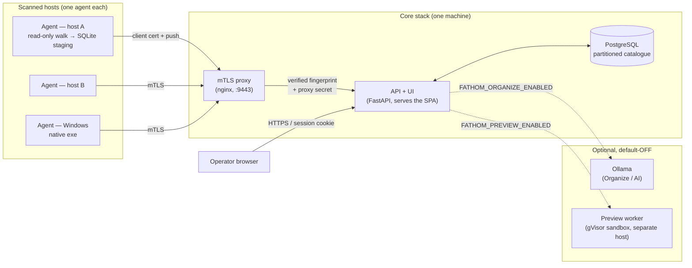

**The trust boundary is the proxy.** Agents never reach the API directly — only the mTLS proxy
can. The proxy verifies each agent's client certificate against your private CA, overwrites the
fingerprint header with the *verified* value, and stamps a shared `X-Fathom-Proxy-Secret` so the
API can prove the request transited the proxy. A direct call that bypasses the proxy is rejected.

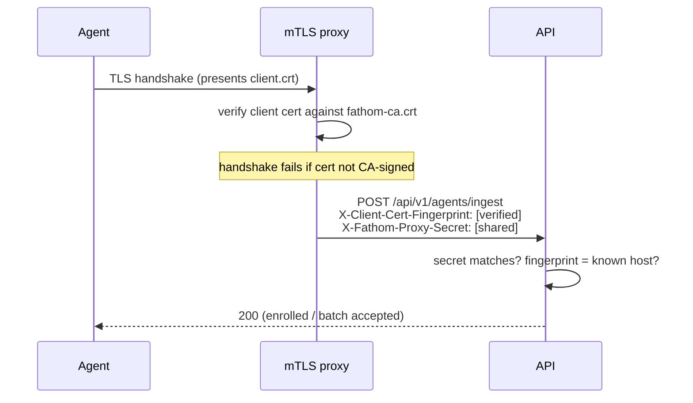

The agent's **identity is its client certificate's SHA-1 fingerprint** — the same value the proxy
stamps and the catalogue keys a host on. A freshly deployed agent therefore enrols deterministically
on its first push.

---

## 2. Pick a topology

| | **Single host (quickstart)** | **Fleet (production)** |
|---|---|---|
| What scans | local directories on the core box | one agent per remote host |
| Transport | agent → API (same box) | agent → **mTLS proxy** → API |
| Certs/CA | not required | **required** (private CA) |
| Use it when | evaluating, or one machine to analyse | real multi-host estate |
| Start at | [§4](#4-first-run--single-host-quickstart) | [§5](#5-first-run--production-fleet) |

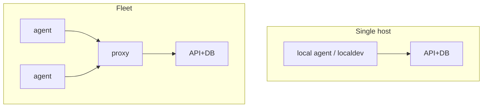

---

## 3. Prerequisites

- **Docker** with the Compose plugin (the only hard requirement for the core).
- **~2 GB RAM** free for the core stack (tunable in `.env`).
- For the fleet path: **OpenSSL** (to mint the CA + server cert) and **network reachability** from
  each agent host to the proxy's IP/port. *That's it — no special hardware, no ZFS, no homelab.*
  ZFS/TrueNAS, NTFS, SMB/SFTP/rclone, AI, and preview are all optional and detected/gated at runtime.

> **The one gotcha that bites strangers:** when you mint the CA, it **must** carry
> `basicConstraints=critical,CA:TRUE` **and** `keyUsage=critical,keyCertSign,cRLSign`. Lenient
> OpenSSL on Linux accepts a CA without `keyUsage`, so an all-Linux fleet works — but a strict TLS
> stack (Python's `ssl` on **Windows**, Go's `crypto/tls`) rejects the whole chain with *"CA cert
> does not include key usage extension"*. The commands in [§5.1](#51-create-the-trust-material) get
> this right; don't hand-roll a shorter `openssl req` that omits the extensions.

---

## 4. First run — single host (quickstart)

The smallest production-shaped stack: **PostgreSQL + schema migration + API/UI** on one machine.
(If you just want to *see* it with sample data in ~60 s, `scripts/localdev/run.sh` uses SQLite and
scans local directories — even quicker. The stack below is the one you grow into.)

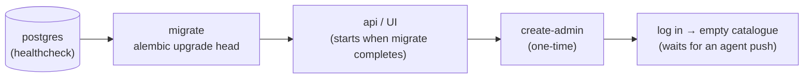

**Step 1 — configure.**

```bash
cd deploy/quickstart
cp .env.example .env
# Edit .env — the two REQUIRED values:
#   FATHOM_DB_PASSWORD        (openssl rand -base64 32)
#   FATHOM_INGEST_PROXY_SECRET (openssl rand -base64 48 | tr -d '/+=' | head -c 48)
```

**Step 2 — bring it up.** The compose orders this for you: postgres becomes healthy → `migrate`
runs `alembic upgrade head` → `api` starts only after migrate completes.

```bash
docker compose up -d --build
```

**Step 3 — create the first admin (one-time; credentials come from the environment, never argv).**

```bash
docker compose exec \
  -e FATHOM_BOOTSTRAP_ADMIN_USER=admin \
  -e FATHOM_BOOTSTRAP_ADMIN_PASSWORD='pick-a-strong-one' \
  api python -m fathom.admin create-admin
```

This is **idempotent** — safe to run on every boot; re-running with an existing admin is a no-op and
does **not** rotate the password.

**Step 4 — log in.** Open <http://127.0.0.1:8088/>. The catalogue is empty until an agent pushes a
scan — point an agent at this box (see [§5.4](#54-deploy-your-first-agent), or use localdev for a
local-directory scan).

---

## 5. First run — production fleet

This is the full multi-host path: a private CA, an mTLS proxy, the core, then agents.

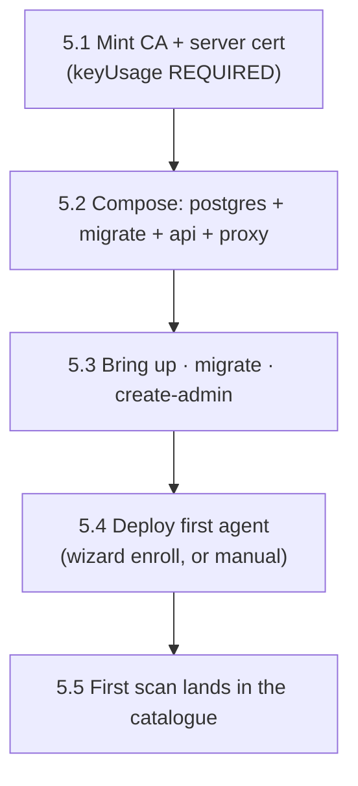

### 5.1 Create the trust material

A private CA signs **one server cert** (for the proxy) and **one client cert per agent**. Keep
`fathom-ca.key` offline-grade safe; everything derives from it.

```bash
mkdir -p certs && cd certs

# --- The CA (the single trust anchor). The extensions are REQUIRED (see §3 gotcha). ---
openssl genrsa -out fathom-ca.key 4096
openssl req -x509 -new -nodes -key fathom-ca.key -sha256 -days 3650 \
  -subj "/O=Fathomline/CN=Fathomline Root CA" \
  -addext "basicConstraints=critical,CA:TRUE" \
  -addext "keyUsage=critical,keyCertSign,cRLSign" \
  -out fathom-ca.crt

# --- Server cert for the proxy. SANs must cover every name/IP agents will dial. ---
openssl genrsa -out server.key 2048
openssl req -new -key server.key -subj "/O=Fathomline/CN=fathom-proxy" -out server.csr
cat > server.ext <<'EXT'
subjectAltName = DNS:proxy,DNS:fathom-proxy,IP:203.0.113.10
extendedKeyUsage = serverAuth
keyUsage = digitalSignature,keyEncipherment
EXT
openssl x509 -req -in server.csr -CA fathom-ca.crt -CAkey fathom-ca.key -CAcreateserial \
  -days 825 -sha256 -extfile server.ext -out server.crt
```

> You do **not** mint agent client certs by hand — the **Deploy wizard** does that ([§5.4](#54-deploy-your-first-agent)).
> If you ever need to re-issue the CA (e.g. to add the `keyUsage` extension to an older CA), do it
> **from the same key** — same subject, same Subject Key Identifier — and every previously signed
> server/client cert stays valid; only the CA cert file is replaced.

### 5.2 The core stack

`deploy/quickstart/` and `deploy/nas-1/` are worked compose examples. The core is four services:

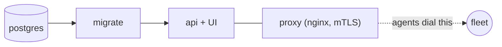

Give the proxy your `server.crt`/`server.key` and the `fathom-ca.crt` to verify client certs:

```nginx
# proxy/nginx.conf (envsubst injects ${FATHOM_INGEST_PROXY_SECRET})
server {
  listen 8443 ssl;
  ssl_certificate     /certs/server.crt;
  ssl_certificate_key /certs/server.key;
  ssl_protocols       TLSv1.2 TLSv1.3;
  ssl_client_certificate /certs/fathom-ca.crt;
  ssl_verify_client      on;          # no CA-signed client cert → rejected at the handshake
  client_max_body_size   32m;

  location /api/v1/agents/ {
    proxy_set_header X-Client-Cert-Fingerprint $ssl_client_fingerprint;  # verified, overwritten
    proxy_set_header X-Fathom-Proxy-Secret "${FATHOM_INGEST_PROXY_SECRET}";
    proxy_set_header Host $host;
    proxy_pass http://api:8080;
  }
}
```

### 5.3 Bring up, migrate, create admin

Same three actions as quickstart ([§4](#4-first-run--single-host-quickstart)): `docker compose up
-d`, the `migrate` service runs `alembic upgrade head`, then the one-time `create-admin`. In
production keep `FATHOM_AUTO_CREATE_SCHEMA=false` — **Alembic owns the schema**, the migrate service
applies it; auto-create is dev/test only.

### 5.4 Deploy your first agent

Two ways. The **Deploy wizard** (default-off; enable per [§8.4](#84-agent-deploy-wizard)) mints the
agent's cert and bundles it for you. **Pull (enrollment-token) mode** is the cleanest:

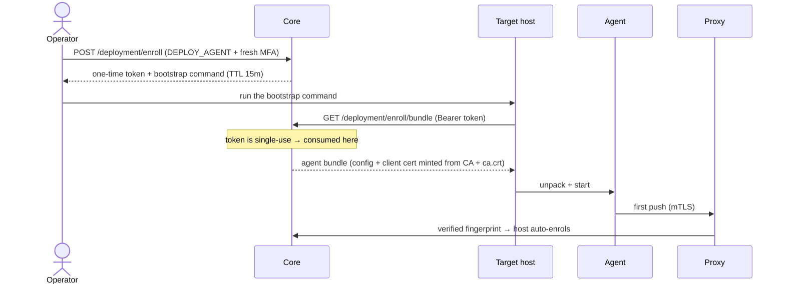

Or deploy an agent **manually**: drop an `agent.config.yaml` next to its certs. Required fields fail
fast if missing (no silent defaults):

```yaml
host_id: nas-1                                  # becomes the host name in the catalogue
ingest_url: https://proxy.example:9443/api/v1/agents/ingest   # MUST be https://
client_cert_path: /certs/client.crt
client_key_path:  /certs/client.key
server_ca_path:   /certs/fathom-ca.crt
throttle:                                       # explicit — no default
  pause_when:  { load1_above: 8.0, iowait_above_percent: 90 }
  resume_when: { load1_below: 4.0 }
scan_scope:                                     # at least one scope OR remote_targets
  - /data
# fullbit_scope: [/data/important]   # opt-in subset that gets content-hashed (dedup)
# cross_mounts: false                # descend into nested mounts
# write_enabled: false               # remediation off by default
```

> **Windows agents:** ship the native `fathomline-agent.exe` (no Docker). Two things are
> Windows-specific and already handled in the agent: NTFS file IDs are reinterpreted to fit SQLite,
> and load-based auto-pause is a **no-op** on Windows (`os.getloadavg` doesn't exist there) — the
> agent runs unthrottled. The CA `keyUsage` requirement in [§3](#3-prerequisites) is **mandatory**
> for Windows agents specifically.

### 5.5 First scan lands

```mermaid
sequenceDiagram
    participant Ag as Agent
    participant St as SQLite staging
    participant Px as Proxy
    participant Api as API
    participant DB as Catalogue
    Ag->>St: walk filesystem → stage entries (resumable)
    Ag->>Px: push batches (≤ FATHOM_INGEST_MAX_BATCH)
    Px->>Api: forward (verified)
    Api->>DB: idempotent upsert by (host, volume, dev, inode)
    Api->>DB: change-feed: CREATE / MODIFY / DELETE rows
    Note over Ag,DB: re-runs are idempotent; deletions come from the feed, never from staleness
```

Refresh the UI — hosts, volumes, treemaps, top-N, growth, and duplicates populate as batches land.

---

## 6. Configuration reference

### 6.1 The golden rule

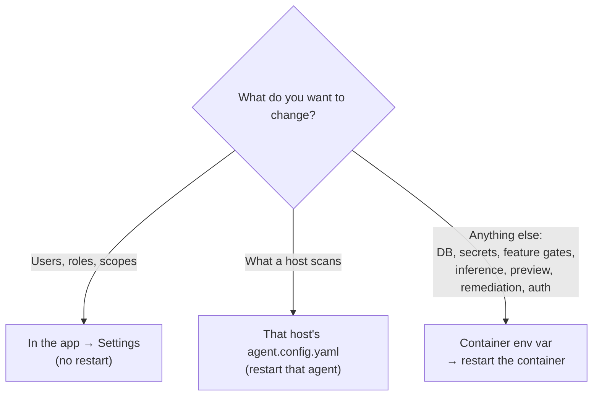

- **Settings page (runtime, no restart):** create/disable **users**, grant/revoke **role
  assignments** (`viewer` · `operator` · `remediator` · `auditor` · `admin`) at **global / host /
  volume** scope. Every grant/revoke is audited. The page also shows a **read-only** view of server
  config — by design it tells you these are set by environment variables, not editable there.
- **Agent config (`agent.config.yaml`, per host):** scan scopes, full-bit allow-list, throttle,
  remote targets, write-enable. Lives on the agent host; restart that agent to apply.
- **Everything else is a core env var, read once at boot.** To change a feature gate, inference
  endpoint, preview limit, remediation setting, or auth — edit the env and **restart the container**.

### 6.2 Required at container level

These have **no usable default** for production — set them before first boot:

| Env var | Why | How to generate |
|---|---|---|
| `FATHOM_DATABASE_URL` | the catalogue DB (compose builds it from `FATHOM_DB_PASSWORD`) | `postgresql+asyncpg://fathom:<pw>@postgres:5432/fathom` |
| `FATHOM_INGEST_PROXY_SECRET` | proves a request transited the proxy; **prod refuses without it** | `openssl rand -base64 48 \| tr -d '/+=' \| head -c 48` |
| `FATHOM_BOOTSTRAP_ADMIN_USER` / `_PASSWORD` | one-time, for `create-admin` only (pass via `-e`, not the file) | choose a strong password |

For the fleet path you also set, when you enable the wizard, the CA references and deployment-specific
URLs ([§8.4](#84-agent-deploy-wizard)).

### 6.3 Optional — sensible defaults; set only to change behavior

Grouped; **all optional** (the listed default applies if you omit it). `*_REF` values are **secret
references** (Docker secret name / OpenBao path), never the secret itself (ADR-010).

**Core / web**
| Var | Default | Notes |
|---|---|---|
| `FATHOM_AUTO_CREATE_SCHEMA` | `false` | dev only; Alembic owns prod schema |
| `FATHOM_INGEST_MAX_BATCH` | `5000` | max rows per ingest batch |
| `FATHOM_WEB_DIST` | unset | set to the built `dist/` to serve the SPA same-origin |
| `FATHOM_TREEMAP_MAX_NODES` / `FATHOM_TOP_N_MAX` / `FATHOM_GROWTH_MAX_BUCKETS` | `200` / `100` / `500` | server-side result caps |
| `FATHOM_CHANGE_LOG_RETENTION_ENABLED` | `false` | prod compose sets `true`; prunes churn feed |
| `FATHOM_CHANGE_LOG_RETENTION_DAYS` | `90` | churn retention window |

**Auth**
| Var | Default | Notes |
|---|---|---|
| `FATHOM_AUTH_PROVIDERS` | `local,forward,oidc` | local-first chain |
| `FATHOM_SESSION_TTL_SECONDS` | `43200` (12h) | server-side session lifetime |
| `FATHOM_SESSION_COOKIE_SECURE` | `true` | set `false` only for local HTTP dev |
| `FATHOM_MFA_FRESHNESS_SECONDS` | `300` | step-up window for destructive routes |
| `FATHOM_OIDC_ISSUER` / `FATHOM_OIDC_CLIENT_ID` | unset | optional SSO; **local admin works without it** |
| `FATHOM_TRUSTED_FORWARD_PROXY_CIDRS` | `()` | empty = trust no forwarded-auth header (fail-closed) |

**Feature gates (all default `false` — flipping on is a deliberate runbook step):**
`FATHOM_AGENT_DEPLOYMENT_ENABLED`, `FATHOM_REMEDIATION_ENABLED`, `FATHOM_ORGANIZE_ENABLED`,
`FATHOM_PREVIEW_ENABLED`. Each has its own settings block — see [§8](#8-optional-subsystems).

### 6.4 What you do *in the app* after launch

Just users and access:

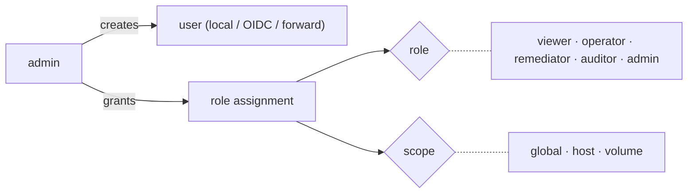

Everything an operator sees is filtered by these scope-checked grants (deny-by-default). There is no
in-app toggle for feature gates or inference/preview/remediation config — that's by design.

---

## 7. Second run & steady state

The second boot is **not** the first boot. What you do — and deliberately do **not** re-do:

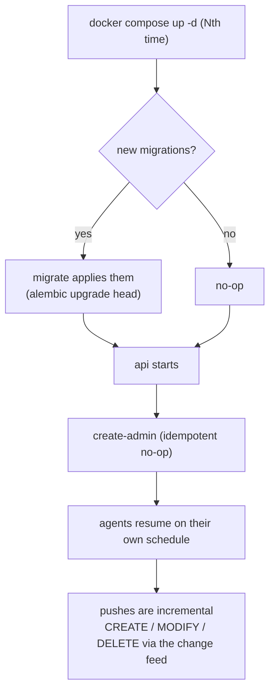

- **Don't re-mint the CA or certs.** They persist; re-issuing invalidates trust unless done
  carefully (same key). Certs are good for ~825 days (leaf) / 10 years (CA).
- **Don't re-create the admin** by hand — it's idempotent, and you now manage users in the UI.
- **Migrations are additive and ordered** — the `migrate` service applies any new ones before the
  API starts. Never point a new image at an unmigrated DB with `AUTO_CREATE_SCHEMA=true`.
- **Agents re-scan on their own** (schedule/cron) and push **incrementally**: a re-run is
  idempotent, and deletions arrive from the change feed — never inferred from a stale snapshot.
- **To change behavior:** edit env → `docker compose up -d` recreates only the changed container.
  Config is read at boot, so a change is inert until the restart.

---

## 8. Optional subsystems

All four are **default-off** and **fail-closed** (the route returns `403`/`503` until both the gate
is on *and* the runtime is provisioned). Turn on only what you need.

### 8.1 Organize (AI) + Ollama

Content-aware classification/move suggestions via a local or remote **Ollama** (no cloud egress by
default). The model runs wherever you point it — on the core box, or a **separate GPU/CPU host** on
your network.

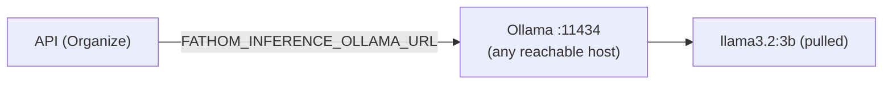

```bash
# On the host that will run Ollama (e.g. a dedicated box):
ollama serve                       # listens on :11434
ollama pull llama3.2:3b            # the default FATHOM_ORGANIZE_MODEL

# Core env:
FATHOM_ORGANIZE_ENABLED=true
FATHOM_INFERENCE_PROVIDER=ollama
FATHOM_INFERENCE_OLLAMA_URL=http://<ollama-host>:11434   # e.g. http://203.0.113.x:11434
FATHOM_ORGANIZE_MODEL=llama3.2:3b
# then: docker compose up -d   (recreates api so it picks up the new URL)
```

> **Gotcha:** enabling Organize while `FATHOM_INFERENCE_OLLAMA_URL` points at a host that isn't
> actually running Ollama (or hasn't pulled the model) leaves the feature **on but non-functional**
> — calls fail at request time. Verify with `curl http://<ollama-host>:11434/api/tags` from the core
> *container's* network before enabling. Cloud (`openai`) requires the extra deliberate
> `FATHOM_INFERENCE_ALLOW_EGRESS=true` plus `FATHOM_INFERENCE_OPENAI_KEY_REF`.

### 8.2 Preview / sandbox (gVisor)

Turns one untrusted file's bytes into **safe derived artifacts only** (thumbnail, first-page raster +
text, syntax highlight) — never raw bytes/SVG/HTML. The *entire* safety argument rests on the
**gVisor (`runsc`) sandbox**, so it has hard host requirements:

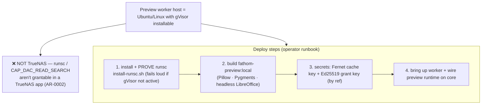

```bash
# On the dedicated worker host (e.g. worker-1 — Ubuntu 24.04), from the repo:
sudo bash deploy/worker-1/install-runsc.sh        # checksum-verified; final probe refuses unless gVisor is live
docker build -f deploy/worker-1/Dockerfile.preview -t fathom-preview:local .
docker compose -f deploy/worker-1/docker-compose.yml --env-file .env up -d --build worker

# Core env:
FATHOM_PREVIEW_ENABLED=true
FATHOM_PREVIEW_SANDBOX_RUNTIME=runsc           # the driver refuses to run under anything else
FATHOM_PREVIEW_SANDBOX_IMAGE=fathom-preview:local
FATHOM_PREVIEW_CACHE_KEY_REF=<secret ref to a urlsafe-base64 Fernet key>   # else ephemeral per-process
```

The raw file reaches the worker only via a **signed, single-use, 60-second, host-scoped grant** over
the agent's existing mTLS channel — no new inbound port, no broad data mount. Per-render sandboxes
are `--network=none`, non-root, read-only rootfs, capped (1 CPU / 512 MiB / 10 s / 50 pages), and
destroyed after each render.

> **Why not on TrueNAS (e.g. nas-1):** you cannot grant `runsc`/`CAP_DAC_READ_SEARCH` inside a
> TrueNAS Custom App, so the sandbox can't hold — preview must live on a normal Linux host.
> If gVisor was ever installed then rolled back on the chosen host, a **residual `runsc` label**
> lingers in `docker info`; re-run `install-runsc.sh` so the deploy doesn't silently fall back to
> `runc` and void the isolation (the installer's probe fails loudly to prevent exactly that).

### 8.3 Remediation (the write/cleanup path)

The only path that **changes the filesystem**. Off by default, and gated at multiple layers:

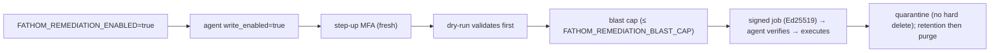

```bash
# 1. Generate the orchestrator signing keypair (Ed25519):
docker compose exec api python -m fathom.admin remediation-keygen /out
#    → load the PRIVATE key into the core's secret backend, set the ref below
#    → distribute the PUBLIC key to each agent (it pins the key id)
# 2. Core env:
FATHOM_REMEDIATION_ENABLED=true
FATHOM_REMEDIATION_SIGNING_KEY_REF=<secret ref to the private key>
FATHOM_REMEDIATION_SIGNING_KEY_ID=orchestrator-v1
FATHOM_REMEDIATION_BLAST_CAP=100        # max items per execute without explicit confirm
# 3. On each agent that may act: write_enabled: true in its agent.config.yaml + a quarantine_dir.
```

There is **no auto-delete**: removed items go to a per-host quarantine and are purge-eligible only
after `FATHOM_QUARANTINE_RETENTION_DAYS` (default 7).

### 8.4 Agent deploy wizard

Lets the core **provision agents** (push over SSH, or pull via enrollment token) and **mint their
certs** from your CA. Off by default; enabling it gives the core the CA signing key.

```bash
# Core env (CA material by reference — never inline):
FATHOM_AGENT_DEPLOYMENT_ENABLED=true
FATHOM_AGENT_DEPLOYMENT_CA_CERT_REF=fathom_ca_cert     # secret holding the CA cert PEM
FATHOM_AGENT_DEPLOYMENT_CA_KEY_REF=fathom_ca_key       # secret holding the CA key PEM
FATHOM_AGENT_DEPLOYMENT_PROXY_HOST_IP=203.0.113.10     # what deployed agents map "proxy" to
FATHOM_AGENT_DEPLOYMENT_CORE_BASE_URL=https://203.0.113.10:18088   # baked into pull bootstrap
FATHOM_AGENT_DEPLOYMENT_INGEST_URL=https://proxy:9443/api/v1/agents/ingest
```

> The container's API user must be able to **read** the secret-backed CA files. A classic failure is
> the CA key mode `0600 root` while the API runs as a non-root uid — copy it readable to that uid
> (e.g. `install -m 0400 -o <uid> -g <gid>`), don't loosen the original.

---

## 9. Troubleshooting

| Symptom | Cause | Fix |
|---|---|---|
| Agent (esp. **Windows/Go**) fails TLS: *"CA cert does not include key usage extension"* | CA minted without `keyUsage` | Re-issue the CA from the same key with `basicConstraints` + `keyUsage=keyCertSign` ([§5.1](#51-create-the-trust-material)); replace only the CA cert in trust stores |
| Ingest returns 4xx / "proxy secret" error | `FATHOM_INGEST_PROXY_SECRET` mismatch between proxy and API, or request bypassed the proxy | Same secret on both; agents must dial the proxy, never the API directly |
| Proxy logs *"connection refused … upstream"* on an IPv6 address every ~minute | nginx round-robins to the API over IPv4 **and** IPv6, but the API listens on IPv4 only | Make the API listen dual-stack, or pin the upstream to IPv4. Requests still succeed via failover — it's log-noise, not breakage |
| Organize enabled but every call fails | `FATHOM_INFERENCE_OLLAMA_URL` points at a host with no Ollama / model not pulled | `ollama pull <model>` on that host; verify `/api/tags` is reachable from the core container |
| `/preview` returns 503 | gate on but runtime not provisioned, or `runsc` not actually active | Re-run `install-runsc.sh`; confirm `FATHOM_PREVIEW_SANDBOX_RUNTIME=runsc` and the worker is up |
| Windows agent crashes mid-scan: *int too large for SQLite* / *os has no attribute getloadavg* | old agent build | Use the current `fathomline-agent.exe` — both are fixed (NTFS id wrap; loadavg degrades to a no-op on Windows) |
| API healthy but UI 404s on refresh | `FATHOM_WEB_DIST` unset | point it at the built `dist/` for same-origin SPA + history fallback |

---

### See also

- [`deploy/quickstart/`](../../deploy/quickstart/) — the single-host compose used in [§4](#4-first-run--single-host-quickstart).
- [`docs/guides/multi-host-deployment.md`](multi-host-deployment.md) — the terser fleet reference.
- [`deploy/worker-1/README.md`](../../deploy/worker-1/README.md) — the full preview/gVisor provisioning runbook.
- ADRs `010` (secrets-by-reference), `011/023/025` (remediation), `014` (preview), `021/022` (organize),
  `026` (deploy wizard), `027` (native Windows agent) under [`docs/decisions/`](../decisions/).
