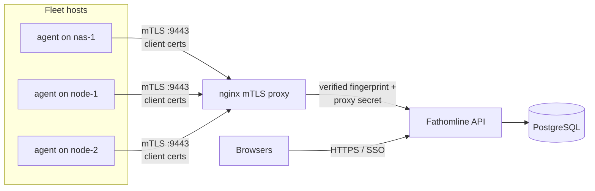

# Multi-host deployment guide

How to grow from the [single-host quickstart](../../deploy/quickstart/README.md) to the full
production shape: a central core, an mTLS boundary for agents, and read-only scan agents on
every host you want covered.



Two trust boundaries, deliberately separate: **humans** reach the API/UI through your HTTPS or
SSO proxy; **agents** reach only `/api/v1/agents/` through the mTLS terminator, identified by
their client-certificate fingerprint. Neither path can cross into the other.

## 0. Prerequisites

- The quickstart stack running (PostgreSQL + migrate + API/UI): `deploy/quickstart/`.
- Docker on each fleet host (agents run as containers; a native Windows agent is on the
  [roadmap](../../ROADMAP.md) — today Windows machines are scanned over SMB instead, see §6).
- A stable address for the core host that every fleet host can reach (the examples use
  `203.0.113.10`).

## 1. Create the trust material (one-time)

A private CA signs one server certificate (for the proxy) and one client certificate per
agent. Keep `fathom-ca.key` offline-grade safe; everything else derives from it.

```bash
mkdir -p certs && cd certs

# The CA — the single trust anchor (10 years). The basicConstraints/keyUsage extensions are
# REQUIRED, not optional: lenient OpenSSL (Linux) tolerates a CA without keyUsage, but strict
# TLS stacks — Python's ssl on Windows, Go's crypto/tls — reject the entire chain with "CA cert
# does not include key usage extension". Omit them and your Linux agents work but a Windows
# agent cannot verify the proxy.
openssl genrsa -out fathom-ca.key 4096
openssl req -x509 -new -nodes -key fathom-ca.key -sha256 -days 3650 \
  -subj "/O=Fathomline/CN=Fathomline Root CA" \
  -addext "basicConstraints=critical,CA:TRUE" \
  -addext "keyUsage=critical,keyCertSign,cRLSign" \
  -out fathom-ca.crt

# Server cert for the mTLS proxy. SANs must cover every name/IP agents will dial.
openssl genrsa -out server.key 2048
openssl req -new -key server.key -subj "/O=Fathomline/CN=fathom-proxy" -out server.csr
cat > server.ext <<'EXT'
subjectAltName = DNS:proxy,DNS:fathom-proxy,IP:203.0.113.10
extendedKeyUsage = serverAuth
keyUsage = digitalSignature,keyEncipherment
EXT
openssl x509 -req -in server.csr -CA fathom-ca.crt -CAkey fathom-ca.key -CAcreateserial \
  -days 825 -sha256 -extfile server.ext -out server.crt
```

You do **not** need to mint agent client certs by hand — the Deploy wizard does that (§4).
Give the core the CA via secret references so it can sign for new agents:

```bash
# .env additions for the core stack
FATHOM_AGENT_DEPLOYMENT_CA_CERT_REF=FATHOM_CA_CERT      # env var / Docker secret holding the PEM
FATHOM_AGENT_DEPLOYMENT_CA_KEY_REF=FATHOM_CA_KEY
```

## 2. Add the mTLS proxy to the core stack

The proxy is the only thing agents can reach. It verifies the client cert against the CA,
**overwrites** the fingerprint header with the verified value, and stamps the shared
`X-Fathom-Proxy-Secret` so the API can prove the request transited this boundary — a direct
call that bypasses the proxy is rejected.

`proxy/nginx.conf.template` (envsubst substitutes only `${FATHOM_INGEST_PROXY_SECRET}`):

```nginx
worker_processes 1;
events { worker_connections 1024; }
http {
  server {
    listen 8443 ssl;
    ssl_certificate     /certs/server.crt;
    ssl_certificate_key /certs/server.key;
    ssl_protocols       TLSv1.2 TLSv1.3;
    ssl_client_certificate /certs/fathom-ca.crt;
    ssl_verify_client      on;          # no CA-signed client cert -> rejected at handshake
    client_max_body_size 32m;

    location /api/v1/agents/ {
      proxy_set_header X-Client-Cert-Fingerprint $ssl_client_fingerprint;
      proxy_set_header X-Fathom-Proxy-Secret "${FATHOM_INGEST_PROXY_SECRET}";
      proxy_set_header Host $host;
      proxy_pass http://api:8080;
    }
    location / { return 404; }          # nothing else crosses this boundary
  }
}
```

Compose service (alongside postgres/migrate/api):

```yaml
  proxy:
    image: nginx:1.27-alpine
    restart: unless-stopped
    ports:
      - "203.0.113.10:9443:8443"     # bind the LAN address agents will dial; 9443 outside
    environment:
      NGINX_ENVSUBST_OUTPUT_DIR: /etc/nginx
      FATHOM_INGEST_PROXY_SECRET: ${FATHOM_INGEST_PROXY_SECRET:?set in .env}
    volumes:
      - ./proxy/nginx.conf.template:/etc/nginx/templates/nginx.conf.template:ro
      - ./certs:/certs:ro
    depends_on:
      api:
        condition: service_healthy
    mem_limit: 256m
```

Publish on **9443** — the Deploy wizard's preflight checks that agents can reach the proxy on
that port. The same `FATHOM_INGEST_PROXY_SECRET` must be set on the `api` service (the
quickstart already requires it).

## 3. Enable the deployment subsystem

It ships OFF. Flipping it on gives the core the ability to mint agent certs and (in push
mode) SSH out — a deliberate step:

```bash
FATHOM_AGENT_DEPLOYMENT_ENABLED=true
FATHOM_AGENT_DEPLOYMENT_PROXY_HOST_IP=203.0.113.10           # what fleet hosts map "proxy" to
FATHOM_AGENT_DEPLOYMENT_CORE_BASE_URL=https://core.example.com:18088   # for pull-bootstrap commands
FATHOM_AGENT_DEPLOYMENT_INGEST_URL=https://proxy:9443/api/v1/agents/ingest
```

Restart the API. The **Deploy** page appears for admins (capability `deploy_agent`, global
scope, fresh step-up MFA for the mutating actions).

## 4. Enrol fleet hosts

**Pull mode (recommended):** in the UI, Deploy → Pull → enter a host id → *Generate command*.
Paste the one-time bootstrap command on the target host; it redeems a short-TTL single-use
token, fetches its personal bundle (compose file, agent config, freshly minted client cert),
loads the agent image if needed, and starts scanning. The token is consumed on redemption.

**Push mode:** Deploy → Push → target address + SSH credential (key auth needs no pinned host
key; password auth requires a preflight + pinned host key first). Works in batches; per-host
results land on the audit chain (`deployment.host.result`).

**Manual (no wizard):** mint a client cert from your CA, then run the agent container with a
config like:

```yaml
# agent.config.yaml
host_id: nas-1
ingest_url: https://proxy:9443/api/v1/agents/ingest
client_cert_path: /certs/client.crt
client_key_path: /certs/client.key
server_ca_path: /certs/fathom-ca.crt
scan_scope:
  - /scan/data          # container path of a read-only mount
cross_mounts: true      # descend child datasets/filesystems under the scope root
fullbit_scope: []       # opt-in trees for full-content hashing (dedup confirmation)
throttle:
  walk_concurrency: 4
  hash_concurrency: 2
  pause_when: { load1_above: 20.0, iowait_above_percent: 25 }
  resume_when: { load1_below: 12.0 }
```

```yaml
  scanner:
    image: fathom:local
    user: "0:0"                      # cap-only-root: uid 0 with ALL caps dropped…
    cap_drop: ["ALL"]
    cap_add: ["DAC_READ_SEARCH"]     # …plus exactly one read-traversal capability
    security_opt: ["no-new-privileges:true"]
    read_only: true
    tmpfs: ["/tmp"]
    command: ["python", "-m", "fathom.agent"]
    environment:
      FATHOM_AGENT_CONFIG: /config/agent.config.yaml
      FATHOM_AGENT_STAGING: /var/lib/fathom/staging.sqlite
    volumes:
      - ./agent.config.yaml:/config/agent.config.yaml:ro
      - ./certs:/certs:ro
      - fathom-staging:/var/lib/fathom        # resumable staging survives restarts
      - /mnt/data:/scan/data:ro               # every scan target mounted READ-ONLY
    extra_hosts:
      - "proxy:203.0.113.10"
    restart: "no"                    # one-shot pass; re-runs are idempotent
```

## 5. Schedule scans

A scan pass is idempotent (change-guarded staging, idempotent ingest) — re-runs push only
new-or-changed entries. Cron the one-shot container off-peak on each host:

```cron
30 2 * * *  cd /opt/fathom-agent && docker compose run --rm -T scanner
```

Agents with a ZFS adapter configured automatically hold full-content scans while an array
resync/scrub is running; the throttle block keeps walks polite under load either way.

## 5b. Remote / cloud scan targets (rclone, SMB, SFTP)

An enrolled agent can also scan **remote** trees — a cloud remote via rclone, or an SMB/SFTP
share — by including `remote_targets` in the enrolment request (or `remote_targets:` in a
hand-written `agent.config.yaml`). The agent scans them metadata-only and pushes them as their own
volumes (they appear with a `rclone://…` / `smb://…` / `sftp://…` label; ADR-029). An agent may be
remote-only (no local `scan_scope`).

```jsonc
// POST /api/v1/deployment/enroll  (or the push DeployHostIn)
{
  "host_id": "cloud-1",
  "mounts": [],                              // remote-only agent: no local scope
  "remote_targets": [
    { "protocol": "rclone", "host": "gdrive", "remote_path": "/Backups" },
    { "protocol": "smb", "host": "nas-1", "share": "media", "username": "scanner",
      "password_ref": "SMB_PW" }             // creds are SECRET REFERENCES (ADR-010), never inline
  ]
}
```

- **rclone targets require an agent image that ships the `rclone` binary** — the default agent
  image does not. Point `FATHOM_AGENT_DEPLOYMENT_IMAGE` at an rclone-equipped image, and configure
  the remote in that host's `rclone.conf` (auth is out of band; the bundle carries no cloud creds).
- SMB/SFTP need no extra binary (the client libs are in the base image); their credentials are
  resolved at runtime from the agent's secret backend by reference.

## 6. Hosts without an agent (Windows, appliances)

Add them as **remote targets** on a nearby agent: SMB for Windows shares, SFTP for anything
with SSH. The agent walks them over the network — slower than local, no incremental feeds,
metadata-only (full-content hashing is deliberately refused over remote transports) — but
zero install on the target. See `remote_targets` in the agent config reference. A native
Windows agent (Server 2016+, Windows 10/11) is on the [roadmap](../../ROADMAP.md).

## 7. Hardening checklist

- API stays bound to localhost / internal network until HTTPS or your SSO (forward-auth /
  OIDC) fronts it; then set `FATHOM_SESSION_COOKIE_SECURE=true`.
- The proxy's published port is reachable from fleet hosts **only** (firewall/VLAN it).
- `FATHOM_INGEST_PROXY_SECRET` set on both api and proxy; rotate by updating both together.
- The write path (`FATHOM_REMEDIATION_ENABLED`) stays **false** until you've read the
  remediation enablement docs; agents additionally ship `write_enabled: false`.
- Back up PostgreSQL (the catalogue) and your `certs/` CA material; agents are disposable.

## Troubleshooting

| Symptom | Likely cause |
|---|---|
| Agent push gets TLS handshake failure | Client cert not signed by the CA the proxy trusts, or SAN mismatch on the dialed name — check `server.ext` SANs |
| Push returns 401/403 at the API | `FATHOM_INGEST_PROXY_SECRET` missing/mismatched between proxy and api, or the agent bypassed the proxy |
| Wizard preflight: "target cannot reach proxy" | Port 9443 not reachable from the target (firewall, wrong `proxy_host_ip`) |
| Scan runs but volumes never appear | Scan scope mounted without `:ro` path matching `scan_scope`, or the walk is paused by the throttle's `pause_when` — check agent logs |
